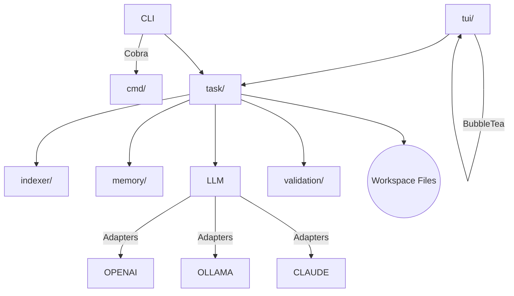

# Loom – Minimalist AI Coding Assistant

<p align="center">
  
</p>

> **Loom** brings an AI pair-programmer to your terminal. It combines lightning-fast code indexing, intelligent file editing with progressive validation, and streaming LLM integration to read, edit, and even run your code – always under your control.
>
> Created by Tim Anthony Alexander

> Date Updated: August 4th, 2025

---

## Table of Contents

1. [Features](#features)
2. [Quick Install](#quick-install)
3. [Getting Started](#getting-started)
4. [Configuration](#configuration)
5. [Core Concepts](#core-concepts)
6. [Task Reference](#task-reference)
7. [Advanced File Editing](#advanced-file-editing)
8. [LOOM_EDIT DSL Reference](#loom_edit-dsl-reference)
9. [TUI Key-bindings](#tui-key-bindings)
10. [CLI Commands](#cli-commands)
11. [Security & Safeguards](#security--safeguards)
12. [Architecture Overview](#architecture-overview)
13. [Contributing](#contributing)
14. [License](#license)

---

## Features

• **Interactive TUI** – Chat with the AI, browse tasks, view file stats, all in a calm Bubble Tea interface.

• **Structured Task Engine** – The AI never touches your files directly. It proposes explicit tasks (READ / LIST / RUN / LOOM_EDIT) that **you confirm**.

• **Advanced File Editing** – Intelligent LOOM_EDIT system with progressive validation, smart action selection, and comprehensive error recovery.

• **Fast Code Indexing** – An embedded ripgrep binary indexes >50k files in seconds with lightweight language statistics.

• **AI Project Summary** – On first launch Loom asks the LLM for a concise overview of the repository (based on README, config files & structure) and shows this summary at the top of every Chat session.

• **Multi-Provider LLMs** – Works with OpenAI, Ollama (local), Claude and more (configure in `~/.loom/projects/PROJECTHASH/config.json`).

• **Context Optimisation** – Automatic summarisation keeps prompts inside model limits without losing history.

• **Session Recovery & Memory** – Automatic crash recovery and a persistent memory store for long-running projects.

• **Cross-Platform** – Tested on macOS, Linux and Windows (native console & WSL).

---

## Quick Install (binary)

Download the pre-built binary for your operating system from the [latest release](https://github.com/timanthonyalexander/loom/releases/latest):

| Platform | File |
| -------- | ---- |
| macOS (Apple Silicon) | `loom-darwin-arm64` |
| macOS (Intel) | `loom-darwin-amd64` |
| Linux x86_64 | `loom-linux-amd64` |
| Windows x86_64 | `loom-windows-amd64.exe` |

### Script to download and install

```bash
# macOS arm64 example
curl -L https://github.com/timanthonyalexander/loom/releases/latest/download/loom-darwin-arm64 \
  -o /usr/local/bin/loom
chmod +x /usr/local/bin/loom
loom --help
```

### Manual Build (Go ≥ 1.23)

```bash
git clone https://github.com/timanthonyalexander/loom.git
cd loom
make build   # outputs ./bin/loom
```

> For local models (Ollama) install [Ollama](https://ollama.ai) separately and pull a model, e.g. `ollama pull codellama`.

---

## Getting Started

```bash
# Inside any project directory
loom
```

* Loom detects the workspace, indexes your files, launches the TUI and greets you with the **system prompt** describing the project.
* On first run, Loom also generates an **AI-written project summary** which is cached (per repo) and shown at the top of every Chat view.
* Ask questions (`"Explain task execution flow"`), request edits, or type `/help` for commands.

### Minimal CLI usage

```bash
# Re-index workspace (runs automatically when files change)
loom index

# Print project stats without TUI
loom stats
```

---

## Configuration

Configuration is stored in a JSON file located in the workspace directory:

```
~/.loom/projects/PROJECTHASH/config.json
```

This file is auto-created on first run with default settings:

```json
{
  "model": "openai:gpt-4o",       // or "ollama:codellama"
  "max_context_tokens": 6000,      // prompt window
  "max_file_size": 200000,         // bytes, truncate large files
  "enable_shell": true             // allow RUN tasks (always confirmed)
}
```

Set provider credentials via environment variables:

* **OpenAI:** `OPENAI_API_KEY`
* **Claude:** `CLAUDE_API_KEY`

### LLM Providers

| Provider | Model string | Auth | Notes |
|----------|--------------|------|-------|
| **OpenAI** | `openai:gpt-4o`, `openai:gpt-3.5-turbo` | `OPENAI_API_KEY` | Official OpenAI REST with streaming & retries |
| **Ollama (local)** | `ollama:codellama` (or any pulled model) | – | Requires [Ollama](https://ollama.ai) daemon running locally |
| **Claude** | `claude:claude-3-opus` | `CLAUDE_API_KEY` | Anthropic Claude v3, full streaming support |

_Implement your own provider by conforming to the simple `llm.LLMAdapter` interface in `llm/`._

---

## Core Concepts

| Concept | Folder | Summary |
|---------|--------|---------|
| **Indexer** | `indexer/` | Recursively scans the workspace using an embedded ripgrep, producing language stats & caches. |
| **LLM Adapters** | `llm/` | Pluggable interfaces for OpenAI, Ollama, Claude. |
| **Task Engine** | `task/` | Parses LLM replies into JSON tasks, executes them with progressive validation, smart action selection, and comprehensive error recovery. |
| **Memory Store** | `memory/` | Lightweight JSON memory with CRUD API exposed to the agent. |
| **TUI** | `tui/` | Bubble Tea interface: chat, file tree (abstract), task viewer. |
| **CLI** | `cmd/` | Cobra commands (`index`, `config`, `sessions`, etc.). |

---

## Task Reference

The AI can request:

| Task | Syntax | Purpose |
|------|--------|---------|
| **READ** | `READ file.go (lines 40-80)` | Inspect code with SHA + line numbers. |
| **LIST** | `LIST src/` | Directory listing. |
| **SEARCH** | `SEARCH "pattern" type:go` | Ripgrep-style code search (no shell). |
| **RUN** | `RUN go test` | Execute shell commands (needs confirmation & `enable_shell:true`). |
| **LOOM_EDIT** | see below | Deterministic file edits. |

### Confirmation Flow

1. AI proposes tasks in JSON.
2. Loom shows a **preview** (for edits it includes a unified diff).
3. You approve (`y`) or reject (`n`).
4. Results are streamed back to the AI for further reasoning.

#### Example Interaction

```json
{
  "tasks": [
    {"type": "READ", "path": "main.go", "max_lines": 120},
    {"type": "SEARCH", "query": "NewPromptEnhancer", "file_types": ["go"]},
    {"type": "RUN", "command": "go test ./...", "timeout": 60}
  ]
}
```

Loom displays file snippets, the diff or command, and waits for your confirmation before executing.

---

## Advanced File Editing

Loom features an intelligent file editing system that combines deterministic operations with comprehensive validation and AI guidance.

### 🎯 Smart Action Selection

The AI automatically analyzes your editing intent and suggests optimal LOOM_EDIT actions:

- **Text Substitution Detection** → Suggests `SEARCH_REPLACE` for variable renames, config updates
- **Content Insertion Analysis** → Recommends `INSERT_AFTER`/`INSERT_BEFORE` over `REPLACE`
- **Structural Modification** → Guides when to use `REPLACE` for complex changes
- **Content Deletion Intelligence** → Suggests `DELETE` instead of empty `REPLACE`

### 🔍 Progressive Validation Pipeline

Every edit goes through a comprehensive validation process:

1. **Syntax Validation** – Verifies LOOM_EDIT command format
2. **File State Check** – Validates file existence, type, and size limits  
3. **Line Range Verification** – Ensures line numbers are valid and current
4. **Content Analysis** – Validates search patterns and target content
5. **Action Optimization** – Analyzes and suggests better action choices
6. **Dry Run Preview** – Shows exactly what changes will be made

### 📊 Enhanced Feedback System

After each edit operation, you receive detailed feedback:

```
✅ EDIT OPERATION SUCCESSFUL
==========================

📁 File: config/settings.json
📊 Status: ✅ File successfully modified

📈 BEFORE/AFTER COMPARISON:
• Lines before: 25 → Lines after: 26 (+1)
• File size: 1.2KB → 1.3KB (+84 bytes)

🔄 CHANGES APPLIED:
• Action: INSERT_AFTER at line 15
• Added 1 new line: "debug": true,

📝 VALIDATION RESULTS:
✅ Syntax check: Passed (12ms)
✅ File validation: Passed (3ms)  
✅ Line range check: Passed (1ms)
✅ Content validation: Passed (2ms)
✅ Action analysis: Optimal choice (5ms)

🎯 ACTION ANALYSIS:
✅ Current Action: INSERT_AFTER (OPTIMAL)
🎯 Detected Intent: content_insertion
📍 Target Scope: middle_insertion
```

### 🛡️ Context-Aware Error Recovery

When edits fail, Loom provides rich, actionable error messages:

```
❌ EDIT OPERATION FAILED
=======================

🚨 Error Type: Line Range Invalid
📁 File: src/handler.go (exists, 45 lines, 2.1KB)
🎯 Requested: REPLACE lines 50-55
❌ Problem: Line 50 exceeds file length (max: 45)

📄 CURRENT FILE CONTEXT:
Line 43: }
Line 44: 
Line 45: // End of file

💡 SUGGESTIONS:
• Use line range 1-45 for valid operations
• READ the file first to see current line count
• Consider INSERT_AFTER 45 to add content at end

🔧 PREVENTION TIPS:
• Always READ files before editing to get current state
• Use SEARCH_REPLACE for text that might move between lines
• Verify line numbers from READ output match your expectations
```

### 🔄 Dry Run Mode

Test edits without applying them:

```
🔍 DRY RUN PREVIEW
=================

📁 File: main.go (45 lines, 1.8KB)
🎯 Proposed Action: REPLACE lines 25-27

📋 CHANGES PREVIEW:
Line 24: func ProcessRequest(req *Request) error {
Line 25: -    return handleRequest(req)  [REMOVED]
Line 26: -}                             [REMOVED]  
Line 27: -                              [REMOVED]
Line 25: +    if err := validateRequest(req); err != nil {  [ADDED]
Line 26: +        return fmt.Errorf("validation failed: %w", err)  [ADDED]
Line 27: +    }                         [ADDED]
Line 28: +    return handleRequest(req)  [ADDED]
Line 29: +}                             [ADDED]
Line 28: 

📊 SUMMARY:
• Lines will change: 45 → 47 (+2)
• File size will change: 1.8KB → 1.9KB (+156 bytes)

⚠️ SAFETY WARNINGS:
• This modifies function logic - ensure tests cover this change
```

---

## LOOM_EDIT DSL Reference

LOOM_EDIT is a deterministic mini-DSL for safe, predictable file edits.

### Basic Syntax

```text
>>LOOM_EDIT file=path/to/file.go ACTION START-END
content here
<<LOOM_EDIT
```

### Actions & Usage Patterns

| Action | Use Case | Example |
|--------|----------|---------|
| **CREATE** | New files | `CREATE 1-1` |
| **SEARCH_REPLACE** | Text substitution | `SEARCH_REPLACE "old" "new"` |
| **INSERT_AFTER** | Add content after line | `INSERT_AFTER 15` |
| **INSERT_BEFORE** | Add content before line | `INSERT_BEFORE 1` |
| **REPLACE** | Complex line modifications | `REPLACE 25-30` |
| **DELETE** | Remove content | `DELETE 10-15` |

### Smart Action Selection Guide

**🔍 For Text Changes** → Use `SEARCH_REPLACE`:
```text
>>LOOM_EDIT file=config.json SEARCH_REPLACE "localhost:8080" "api.example.com"
<<LOOM_EDIT
```

**➕ For Adding Content** → Use `INSERT_AFTER`/`INSERT_BEFORE`:
```text
>>LOOM_EDIT file=main.go INSERT_AFTER 5
import "time"
<<LOOM_EDIT
```

**⚙️ For Complex Changes** → Use `REPLACE`:
```text
>>LOOM_EDIT file=handler.go REPLACE 15-17
func ProcessRequest(ctx context.Context, req *Request) (*Response, error) {
    return handleRequest(ctx, req)
}
<<LOOM_EDIT
```

**🗑️ For Removing Content** → Use `DELETE`:
```text
>>LOOM_EDIT file=old.go DELETE 25-35
<<LOOM_EDIT
```

### Key Rules

* Always `READ` files first to get current state and line numbers
* Line numbers are 1-based inclusive  
* The closing tag `<<LOOM_EDIT` is mandatory
* Cross-platform newlines are normalized automatically
* Files are validated before and after each operation

---

## TUI Key-bindings

| Key | Action |
|-----|--------|
| **Enter** | Send message / confirm dialog |
| **Tab** | Switch Chat ↔ File Tree ↔ Tasks |
| **↑ / ↓** | Scroll messages (Chat) or navigate autocomplete |
| **Ctrl + S** | Summarise current session |
| **Ctrl + C** | Cancel streaming / exit confirmation |
| **/@** | Trigger command / file autocomplete |

Slash commands inside Chat: `/files`, `/stats`, `/tasks`, `/test`, `/summary`, `/rationale`, `/debug`, `/help`, `/quit`.

---

## CLI Commands

```text
loom                # Launch interactive TUI (default)
loom index          # Rebuild file index
loom config get k   # Get config value
loom config set k v # Set config value
loom sessions       # List previous chat sessions
loom migrate        # Migrate cache format (if prompted after version upgrades)
```

Run `loom <command> --help` for full usage.

---

## Security & Safeguards

* **Explicit Tasks** – No hidden actions; every file read, edit, or shell command is visible.
* **Confirmation Dialogs** – Destructive tasks (`RUN`, `LOOM_EDIT`) always require `y / n`.
* **Progressive Validation** – Multi-stage validation pipeline prevents invalid or dangerous edits.
* **Dry Run Capability** – Preview changes without applying them to ensure safety.
* **Context-Aware Errors** – Rich error messages with file state and recovery suggestions.
* **Workspace Jail** – Access is restricted to the current workspace path – no `../` escapes.
* **Secret Scrubbing** – Known secret patterns are redacted from file previews.
* **Safe Defaults** – Shell disabled unless `enable_shell:true`.
* **Action Optimization** – AI guidance prevents inefficient or problematic edit operations.

---

## Architecture Overview



The Task Engine features a sophisticated **Progressive Validation Pipeline** that processes every edit through multiple stages: syntax validation, file state verification, line range checking, content analysis, action optimization, and optional dry-run preview.

---

## Contributing

1. Fork the repo & clone.
2. `make test` – run the unit test suite.
3. Follow Go formatting (`go fmt ./...`).
4. Open a PR with a clear description. The AI prompt enhancer will guide the review.

> **Coding style**: Small, composable functions, explicit error returns, table-driven tests.

---

## License

This project is licensed under the [MIT License](LICENSE).
