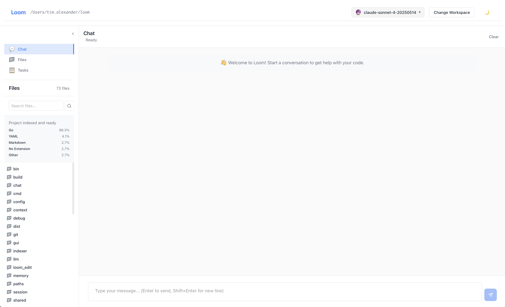
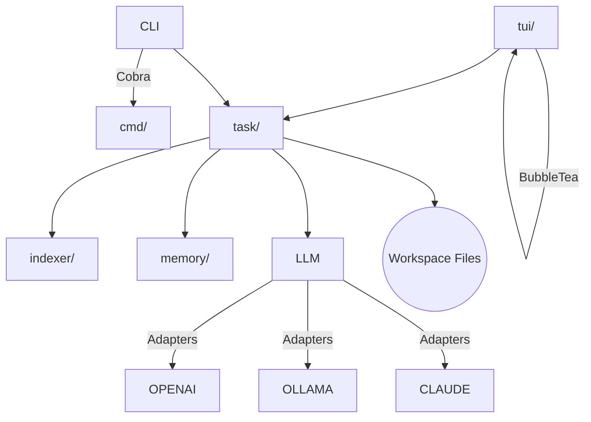

# Loom – Minimalist AI Coding Assistant

<p align="center">
  
</p>

> **Loom** brings an AI pair-programmer to your terminal. It combines lightning-fast code indexing, a powerful task engine, and streaming LLM integration to read, edit, and even run your code – always under your control.
>
> Created by Tim Anthony Alexander

---

## Table of Contents

1. [Features](#features)
2. [Quick Install](#quick-install)
3. [Getting Started](#getting-started)
4. [Configuration](#configuration)
5. [Core Concepts](#core-concepts)
6. [Task Reference](#task-reference)
7. [Editing with LOOM_EDIT](#editing-with-loom_edit)
8. [TUI Key-bindings](#tui-key-bindings)
9. [CLI Commands](#cli-commands)
10. [Security & Safeguards](#security--safeguards)
11. [Architecture Overview](#architecture-overview)
12. [Contributing](#contributing)
13. [License](#license)

---

## Features

• **Interactive TUI** – Chat with the AI, browse tasks, view file stats, all in a calm Bubble Tea interface.

• **Structured Task Engine** – The AI never touches your files directly. It proposes explicit tasks (READ / LIST / RUN / LOOM_EDIT) that **you confirm**.

• **Fast Code Indexing** – An embedded ripgrep binary indexes >50k files in seconds with lightweight language statistics.

• **AI Project Summary** – On first launch Loom asks the LLM for a concise overview of the repository (based on README, config files & structure) and shows this summary at the top of every Chat session.

• **Multi-Provider LLMs** – Works with OpenAI, Ollama (local), Claude and more (configure in `~/.loom/projects/PROJECTHASH/config.json`).

• **Context Optimisation** – Automatic summarisation keeps prompts inside model limits without losing history.

• **Session Recovery & Memory** – Automatic crash recovery and a persistent memory store for long-running projects.

• **Cross-Platform** – Tested on macOS, Linux and Windows (native console & WSL).

---

## Quick Install (binary)

Download the pre-built binary for your operating system from the [latest release](https://github.com/timanthonyalexander/loom/releases/latest):

| Platform | File |
| -------- | ---- |
| macOS (Apple Silicon) | `loom-darwin-arm64` |
| macOS (Intel) | `loom-darwin-amd64` |
| Linux x86_64 | `loom-linux-amd64` |
| Windows x86_64 | `loom-windows-amd64.exe` |

### Script to download and install

```bash
# macOS arm64 example
curl -L https://github.com/timanthonyalexander/loom/releases/latest/download/loom-darwin-arm64 \
  -o /usr/local/bin/loom
chmod +x /usr/local/bin/loom
loom --help
```

### Manual Build (Go ≥ 1.23)

```bash
git clone https://github.com/timanthonyalexander/loom.git
cd loom
make build   # outputs ./bin/loom
```

> For local models (Ollama) install [Ollama](https://ollama.ai) separately and pull a model, e.g. `ollama pull codellama`.

---

## Getting Started

```bash
# Inside any project directory
loom
```

* Loom detects the workspace, indexes your files, launches the TUI and greets you with the **system prompt** describing the project.
* On first run, Loom also generates an **AI-written project summary** which is cached (per repo) and shown at the top of every Chat view.
* Ask questions (`"Explain task execution flow"`), request edits, or type `/help` for commands.

### Minimal CLI usage

```bash
# Re-index workspace (runs automatically when files change)
loom index

# Print project stats without TUI
loom stats
```

---

## Configuration

Configuration is stored in a JSON file located in the workspace directory:

```
~/.loom/projects/PROJECTHASH/config.json
```

This file is auto-created on first run with default settings:

```json
{
  "model": "openai:gpt-4o",       // or "ollama:codellama"
  "max_context_tokens": 6000,      // prompt window
  "max_file_size": 200000,         // bytes, truncate large files
  "enable_shell": true             // allow RUN tasks (always confirmed)
}
```

Set provider credentials via environment variables:

* **OpenAI:** `OPENAI_API_KEY`
* **Claude:** `CLAUDE_API_KEY`

### LLM Providers

| Provider | Model string | Auth | Notes |
|----------|--------------|------|-------|
| **OpenAI** | `openai:gpt-4o`, `openai:gpt-3.5-turbo` | `OPENAI_API_KEY` | Official OpenAI REST with streaming & retries |
| **Ollama (local)** | `ollama:codellama` (or any pulled model) | – | Requires [Ollama](https://ollama.ai) daemon running locally |
| **Claude** | `claude:claude-3-opus` | `CLAUDE_API_KEY` | Anthropic Claude v3, full streaming support |

_Implement your own provider by conforming to the simple `llm.LLMAdapter` interface in `llm/`._

---

## Core Concepts

| Concept | Folder | Summary |
|---------|--------|---------|
| **Indexer** | `indexer/` | Recursively scans the workspace using an embedded ripgrep, producing language stats & caches. |
| **LLM Adapters** | `llm/` | Pluggable interfaces for OpenAI, Ollama, Claude. |
| **Task Engine** | `task/` | Parses LLM replies into JSON tasks, executes them with safety hooks and confirmation dialogs. |
| **Memory Store** | `memory/` | Lightweight JSON memory with CRUD API exposed to the agent. |
| **TUI** | `tui/` | Bubble Tea interface: chat, file tree (abstract), task viewer. |
| **CLI** | `cmd/` | Cobra commands (`index`, `config`, `sessions`, etc.). |

---

## Task Reference

The AI can request:

| Task | Syntax | Purpose |
|------|--------|---------|
| **READ** | `READ file.go (lines 40-80)` | Inspect code with SHA + line numbers. |
| **LIST** | `LIST src/` | Directory listing. |
| **SEARCH** | `SEARCH "pattern" type:go` | Ripgrep-style code search (no shell). |
| **RUN** | `RUN go test` | Execute shell commands (needs confirmation & `enable_shell:true`). |
| **LOOM_EDIT** | see below | Deterministic file edits. |

### Confirmation Flow

1. AI proposes tasks in JSON.
2. Loom shows a **preview** (for edits it includes a unified diff).
3. You approve (`y`) or reject (`n`).
4. Results are streamed back to the AI for further reasoning.

#### Example Interaction

```json
{
  "tasks": [
    {"type": "READ", "path": "main.go", "max_lines": 120},
    {"type": "SEARCH", "query": "NewPromptEnhancer", "file_types": ["go"]},
    {"type": "RUN", "command": "go test ./...", "timeout": 60}
  ]
}
```

Loom displays file snippets, the diff or command, and waits for your confirmation before executing.

---

## Editing with LOOM_EDIT

LOOM_EDIT is a mini-DSL that guarantees safe, line-based edits with SHA verification.

```text
>>LOOM_EDIT file=path/to/file.go REPLACE 42-45
// new content here
<<LOOM_EDIT
```

Actions: `REPLACE`, `INSERT_AFTER`, `INSERT_BEFORE`, `DELETE`, `SEARCH_REPLACE`, `CREATE`.

Rules:

* Always `READ` first to fetch line numbers & SHA.
* Line numbers are 1-based inclusive.
* The closing tag `<<LOOM_EDIT` is mandatory.
* Cross-platform newlines are normalised automatically.

---

## TUI Key-bindings

| Key | Action |
|-----|--------|
| **Enter** | Send message / confirm dialog |
| **Tab** | Switch Chat ↔ File Tree ↔ Tasks |
| **↑ / ↓** | Scroll messages (Chat) or navigate autocomplete |
| **Ctrl + S** | Summarise current session |
| **Ctrl + C** | Cancel streaming / exit confirmation |
| **/@** | Trigger command / file autocomplete |

Slash commands inside Chat: `/files`, `/stats`, `/tasks`, `/test`, `/summary`, `/rationale`, `/debug`, `/help`, `/quit`.

---

## CLI Commands

```text
loom                # Launch interactive TUI (default)
loom index          # Rebuild file index
loom config get k   # Get config value
loom config set k v # Set config value
loom sessions       # List previous chat sessions
loom migrate        # Migrate cache format (if prompted after version upgrades)
```

Run `loom <command> --help` for full usage.

---

## Security & Safeguards

* **Explicit Tasks** – No hidden actions; every file read, edit, or shell command is visible.
* **Confirmation Dialogs** – Destructive tasks (`RUN`, `LOOM_EDIT`) always require `y / n`.
* **Workspace Jail** – Access is restricted to the current workspace path – no `../` escapes.
* **Secret Scrubbing** – Known secret patterns are redacted from file previews.
* **Safe Defaults** – Shell disabled unless `enable_shell:true`.

---

## Architecture Overview



---

## Contributing

1. Fork the repo & clone.
2. `make test` – run the unit test suite.
3. Follow Go formatting (`go fmt ./...`).
4. Open a PR with a clear description. The AI prompt enhancer will guide the review.

> **Coding style**: Small, composable functions, explicit error returns, table-driven tests.

---

## License

This project is licensed under the [MIT License](LICENSE).
