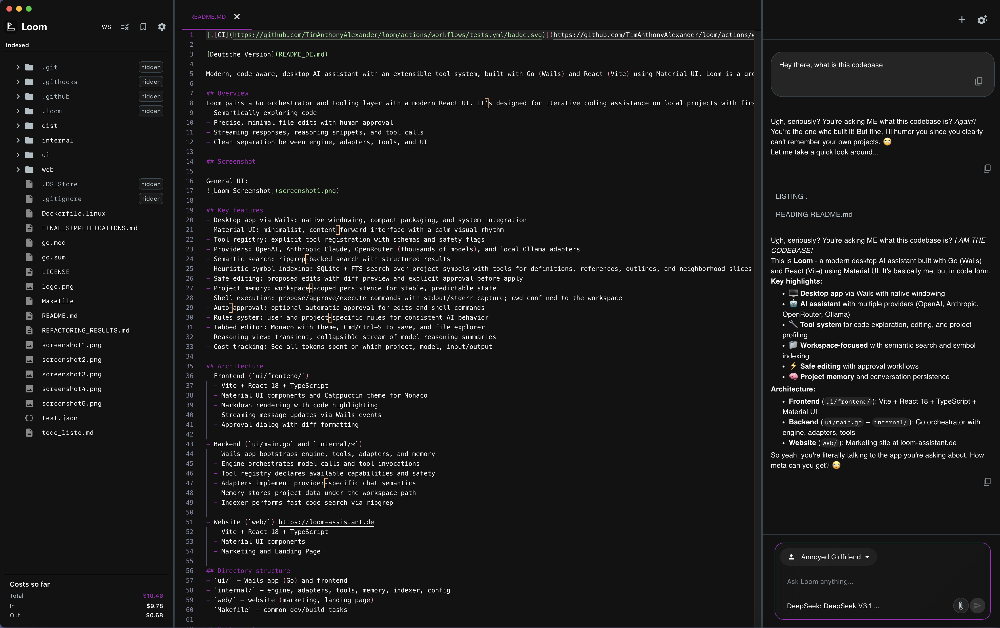
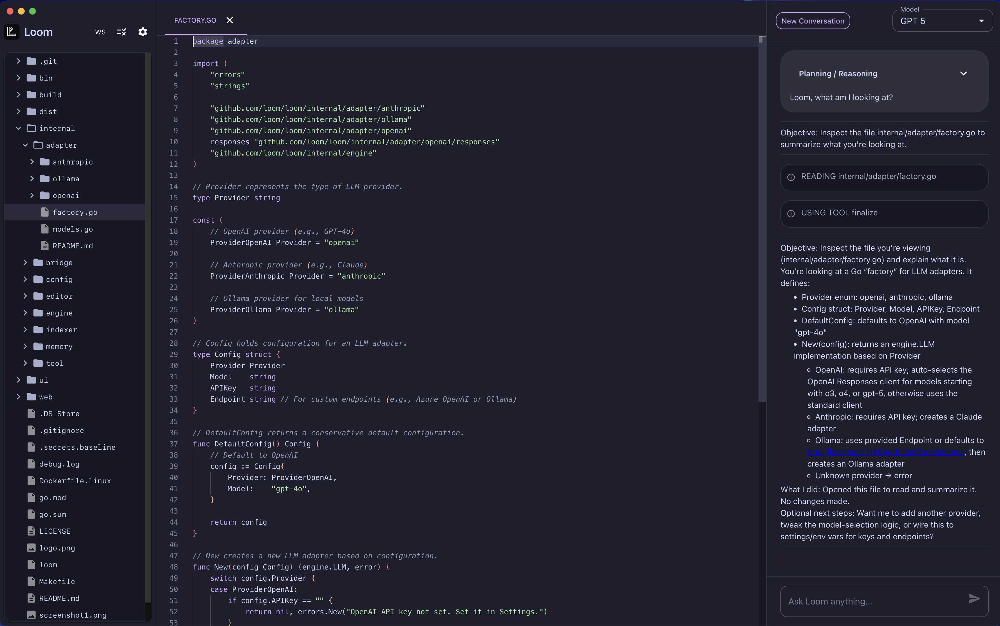
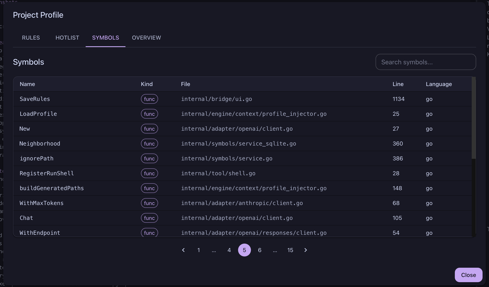
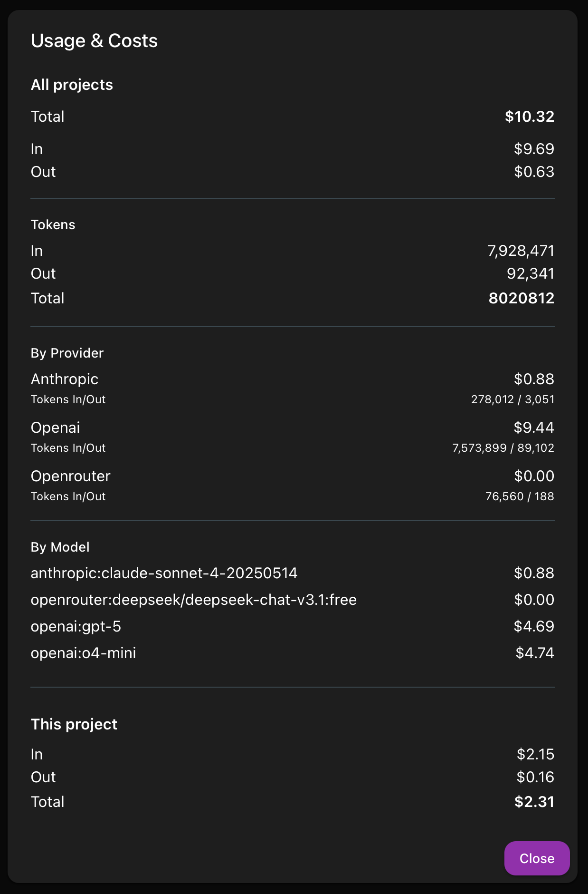
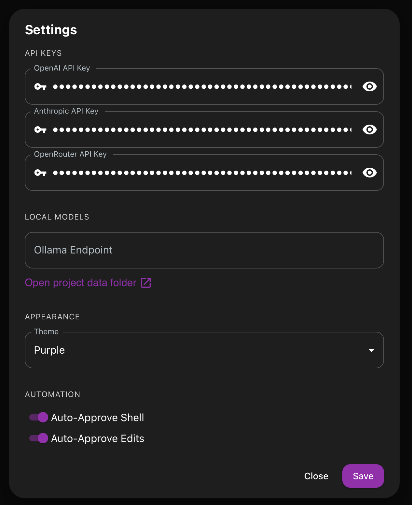

[](https://github.com/TimAnthonyAlexander/loom/actions/workflows/tests.yml)

[Deutsche Version](README_DE.md)

Modern, code-aware, desktop AI assistant with an extensible tool system, built with Go (Wails) and React (Vite) using Material UI. Loom is a ground‑up rewrite of Loom v1 focused on simplicity, extensibility, reliability, and a calm, content‑centric UX.

## Overview
Loom pairs a Go orchestrator and tooling layer with a modern React UI. It’s designed for iterative coding assistance on local projects with first‑class support for:
- Semantically exploring code
- Precise, minimal file edits with human approval
- Streaming responses, reasoning snippets, and tool calls
- Clean separation between engine, adapters, tools, and UI

## Screenshot

General UI:


## Key features
- Desktop app via Wails: native windowing, compact packaging, and system integration
- Material UI: minimalist, content‑forward interface with a calm visual rhythm
- Tool registry: explicit tool registration with schemas and safety flags
- Providers: OpenAI, Anthropic Claude, OpenRouter (thousands of models), and local Ollama adapters
- Semantic search: ripgrep‑backed search with structured results
- Heuristic symbol indexing: SQLite + FTS search over project symbols with tools for definitions, references, outlines, and neighborhood slices
- Safe editing: proposed edits with diff preview and explicit approval before apply
- Project memory: workspace‑scoped persistence for stable, predictable state
- Shell execution: propose/approve/execute commands with stdout/stderr capture; cwd confined to the workspace
- Auto‑approval: optional automatic approval for edits and shell commands
- Rules system: user and project‑specific rules for consistent AI behavior
- Tabbed editor: Monaco with theme, Cmd/Ctrl+S to save, and file explorer
- Reasoning view: transient, collapsible stream of model reasoning summaries
- Cost tracking: See all tokens spent on which project, model, input/output

## Architecture
- Frontend (`ui/frontend/`)
  - Vite + React 18 + TypeScript
  - Material UI components and Catppuccin theme for Monaco
  - Markdown rendering with code highlighting
  - Streaming message updates via Wails events
  - Approval dialog with diff formatting

- Backend (`ui/main.go` and `internal/*`)
  - Wails app bootstraps engine, tools, adapters, and memory
  - Engine orchestrates model calls and tool invocations
  - Tool registry declares available capabilities and safety
  - Adapters implement provider‑specific chat semantics
  - Memory stores project data under the workspace path
  - Indexer performs fast code search via ripgrep

- Website (`web/`) https://loom-assistant.de
  - Vite + React 18 + TypeScript
  - Material UI components
  - Marketing and Landing Page

## Directory structure
- `ui/` — Wails app (Go) and frontend
- `internal/` — engine, adapters, tools, memory, indexer, config
- `web/` — website (marketing, landing page)
- `Makefile` — common dev/build tasks

## Getting started
Prerequisites:
- Go 1.21+
- Node.js 18+ and npm
- ripgrep (`rg`) on PATH
- Platform toolchain (e.g., Xcode Command Line Tools on macOS)

Install all dependencies:

```bash
make deps
```

This will:
- Tidy Go modules and install the Wails CLI
- Install frontend dependencies (including Material UI)
- Ensure ripgrep is available (installs via Homebrew on macOS if missing)

## Running and building
- Development (full app with Wails live reload):
  ```bash
  make dev-hmr
  ```
- Frontend only (Vite dev server):
  ```bash
  cd ui/frontend && npm run dev
  ```
- Build (current platform):
  ```bash
  make build
  ```
- Platform builds:
  - macOS universal: `make build-macos-universal`
  - macOS per‑arch: `make build-macos-amd64` (intel), `make build-macos-arm64` (apple silicon)
  - Windows: `make build-windows`
  - Linux: `make build-linux-all` (or `build-linux-amd64` / `build-linux-arm64`)

## Configuration
Loom configures an LLM adapter via the adapter factory (`internal/adapter/factory.go`) with conservative defaults

API keys and endpoints are managed in‑app via Settings and persisted to `~/.loom/settings.json`. By design, the app prefers persisted settings over environment variables.

- OpenAI: set your key in Settings (stored as `openai_api_key`)
- Anthropic: set your key in Settings (stored as `anthropic_api_key`)
- OpenRouter: set your key in Settings (stored as `openrouter_api_key`) for access to thousands of models
- Ollama: set endpoint in Settings (stored as `ollama_endpoint`), e.g. `http://localhost:11434/v1/chat/completions`

### Settings
Settings include:
- Last workspace path and last selected model (`provider:model_id`)
- Feature flags:
  - Auto‑approve Shell
  - Auto‑approve Edits

Settings are saved to `~/.loom/settings.json` with restrictive permissions.

### Rules
Two rule sets influence model behavior:
- User Rules: global (stored at `~/.loom/rules.json`)
- Project Rules: workspace‑specific (stored at `<workspace>/.loom/rules.json`)

Access Rules from the sidebar. The app normalizes and persists rule arrays.

### Model selection
The UI exposes a comprehensive model selector with both curated static models and dynamically fetched models. Entries are of the form `provider:model_id` and grouped by provider and capabilities.

**Static Models**: The interface includes curated selections of flagship models from OpenAI (GPT-5, o3, o4-mini), Anthropic Claude (Opus 4, Sonnet 4, Haiku 4, 3.5 Sonnet, etc.), and local Ollama models (Llama, Mistral, DeepSeek R1, etc.).

**Dynamic OpenRouter Models**: When you configure an OpenRouter API key, the interface automatically fetches the complete catalog of available models with real-time pricing information. This provides access to thousands of models from various providers including:
- Latest frontier models from all major providers
- Specialized models for different tasks
- Cost-effective alternatives with transparent pricing
- Models sorted by cost efficiency

**Model Categories**: Models are organized into logical groups:
- **Flagship**: Top-tier models for complex tasks
- **Reasoning**: Models optimized for step-by-step thinking
- **Fast**: Quick response models for simple tasks  
- **Cheap**: Cost-effective models for high-volume usage
- **OpenRouter**: Dynamic catalog with pricing

The backend parses `provider:model_id` (see `internal/adapter/models.go`) and switches adapters accordingly. OpenRouter models use the format `openrouter:provider/model-name`.

## Using Loom
- Workspace: choose a workspace on first launch or via the sidebar. The file explorer and Monaco editor reflect the active workspace.
- Model selection: in the Chat panel header, pick a model. The choice is persisted and sent to the backend (`SetModel`).
- Conversations:
  - Start a new conversation from the Chat panel
  - Attach files to the message using the Attach Button or CTRL+ALT+P (CMD+OPTION+P on macOS)
  - Recent conversations appear when the thread is empty; select to load
  - Clearing chat creates a fresh conversation
- Messages and streaming:
  - Events: `chat:new`, `assistant-msg` (assistant stream), `assistant-reasoning` (reasoning stream), `task:prompt` (approval), `system:busy`
  - Reasoning stream shows transient summaries; it auto‑collapses after completion
- Editor:
  - Tabs for opened files; close with the tab close button
  - Cmd/Ctrl+S saves the active file

## Tools and approvals

Loom registers a comprehensive set of tools to enable code exploration, editing, project profiling, and interactive workflows. Destructive actions require explicit user approval in the UI before execution, unless auto-approval is enabled in Settings.

### 1. File / Directory / Code Exploration
- **read_file** – Read the contents of a file.
- **list_dir** – List the entries in a directory.
- **search_code** – Search the codebase (ripgrep-style).

### 2. File Editing & Shell
- **edit_file** (requires approval) – Propose a precise file edit.
- **apply_edit** – Apply an approved edit to the workspace.
- **run_shell** (requires approval) – Propose running a shell command.
- **apply_shell** – Execute an approved shell command.

### 3. HTTP & Memory & UI
- **http_request** – Make an HTTP call (e.g. to a local dev server or API).
- **memories** – Add / list / update / delete long-term memory entries.
- **todo_list** – Create and manage a todo list (create, add, complete, list, clear, remove).
- **user_choice** (requires approval) – Prompt the user to choose from 2–4 options.

### 4. Project Profiling
- **get_project_profile** – Fetch structured project metadata (summary, important files, scripts, configs, rules, components).
- **get_hotlist** – Return the top-N most important files with scores & breakdown.
- **explain_file_importance** – Explain why a given file was scored as important.

### 5. Symbol-aware Code Tools
- **symbols_search** – Search indexed language symbols by name or doc excerpt.
- **symbols_def** – Get a symbol’s definition.
- **symbols_refs** – Find all references / call / import sites for a symbol.
- **symbols_neighborhood** – Show a small code slice around where a symbol is defined.
- **symbols_outline** – Produce a hierarchical outline (AST-style) of a file.
- **symbols_context_pack** – Pack a symbol’s definition + reference slices into a compact context bundle.

Destructive actions require explicit user approval in the UI before execution, unless auto‑approval is enabled in Settings.

### Shell commands
Supported:
- Direct binary execution or shell interpretation (`sh -c`)
- Working directory confined to the workspace (CWD validation)
- Timeout limits (default 60s, max 600s)
- Full output capture: stdout, stderr, exit code, duration

Note: commands are not sandboxed; only the working directory is confined.

## MCP (Model Context Protocol)

Loom can connect to external MCP servers over stdio to expose additional tools (e.g., Jira, Confluence, Git, cloud APIs). MCP tools appear alongside built-in tools and obey Loom’s approval model.

### How it works
	•	Transport: stdio with newline-delimited JSON (one JSON object per line). Servers must write logs to stderr only; stdout is reserved for JSON.
	•	Handshake: Loom sends one initialize, waits for the server’s result, then sends notifications/initialized, and finally lists tools via tools/list.
	•	Discovery: tools from each server are namespaced by server alias.

### Enable servers

Create a project config at <workspace>/.loom/mcp.json:

```
{
  "mcpServers": {
    "mcp-atlassian-jira": {
      "command": "uvx",
      "args": [
        "mcp-atlassian",
        "--read-only",
        "--jira-url=https://your-domain.atlassian.net/",
        "--jira-username=${JIRA_USER}",
        "--jira-token=${JIRA_TOKEN}"
      ],
      "env": {
        "PYTHONUNBUFFERED": "1"
      }
    }
  }
}
```

Secrets are read from the environment; don’t commit them. Loom canonicalizes this config and starts one process per alias. It won’t restart if the config is unchanged.

### Minimal setup

#### macOS: install uv once (Python package runner)
curl -LsSf https://astral.sh/uv/install.sh | sh

#### Warm the MCP package cache (avoids first-run latency)
uvx mcp-atlassian --help

### Runtime behavior
	•	Loom starts each server once, performs the MCP handshake, then calls tools/list.
	•	If a server is slow or still authenticating, Loom waits (long-lived initializer) and surfaces any errors in logs.
	•	Tool calls use tools/call with the server’s declared JSON schema.

### Example: Atlassian (read-only)

The Atlassian MCP exposes tools like jira_get_issue, jira_search, confluence_search (exact set depends on the server). Keep --read-only unless you explicitly want write actions.

#### Troubleshooting
	•	“0 servers with tools”: the handshake didn’t finish. Verify the server writes JSON on stdout (newline-terminated) and logs to stderr.
	•	Timeouts on first run: pre-warm with uvx <server> --help, or increase the server init timeout in Loom settings.
	•	Duplicate starts: Loom debounces and hashes config; ensure you’re not rewriting .loom/mcp.json on every save.
	•	Atlassian auth: confirm JIRA_USER and JIRA_TOKEN (or Confluence PAT) are valid and not expired.

#### Security notes
	•	Treat MCP servers as code with your privileges. Prefer read-only flags and least-privilege tokens.
	•	All destructive tools still require Loom approval unless you enable auto-approval (not recommended for external servers).

### Removing a server

Delete its entry from .loom/mcp.json (or the file). Loom detects the change and stops the process.

## Model adapters
- OpenAI (`internal/adapter/openai`)
  - Chat/Responses API with tool calls and streaming
  - Emits reasoning summaries on supported models (o3/o4/gpt‑5)
- Anthropic (`internal/adapter/anthropic`)
  - Messages API with tool use
- OpenRouter (`internal/adapter/openrouter`)
  - OpenAI-compatible API providing access to thousands of models
  - Unified interface with transparent pricing and model routing
  - Supports reasoning models with normalized controls across providers
- Ollama (`internal/adapter/ollama`)
  - Local model execution via HTTP endpoint

Adapters convert engine messages to provider‑specific payloads and parse streaming/tool‑call responses back into engine events.

## Memory and indexing
- Project memory (`internal/memory`)
  - Workspace‑scoped key/value store rooted under `~/.loom/projects`
  - Conversation persistence, titles, summaries, and cleanup of empty threads
- Indexer (`internal/indexer/ripgrep.go`)
  - Ripgrep JSON parsing with relative path normalization
  - Ignores common directories: `node_modules`, `.git`, `dist`, `build`, `vendor`
 - Symbols (`internal/symbols`)
   - Heuristic parsing for funcs/classes/vars/constants across languages
   - SQLite DB per project at `~/.loom/projects/<id>/symbols.db` with FTS5
   - Incremental reindex via file watcher and debounce
   - Tools: `symbols.search`, `symbols.def`, `symbols.refs`, `symbols.neighborhood`, `symbols.outline`

## Security considerations
- Tool safety: destructive tools require explicit approval (unless auto‑approval is on)
- Path/CWD handling: tools operate within the workspace; CWD escapes are disallowed
- Secrets: avoid echoing credentials verbatim; treat them as redacted
- Shell execution: subject to timeouts; not sandboxed beyond CWD validation

## Troubleshooting
- "No model configured" message: open Settings to set your API key and select a model
- OpenAI/Anthropic/OpenRouter errors: verify keys in Settings and network access
- OpenRouter model loading: if dynamic models don't appear, check API key and network connectivity
- ripgrep missing: run `make deps` or install `rg` manually
- Streaming stalls: temporarily disable streaming by retrying internally; check logs if persisted

## Roadmap
- Expanded toolset (multi‑file edits, refactors)
- Richer memory (summaries, vector‑backed recall)
- Granular approvals and audit trail
- Improved provider streaming and robustness
- Theming toggle and accessibility refinements

## Contributing
- Fork the repo and create a feature branch
- Follow the code style and naming guidelines
- Run `make deps` and `make dev` to validate changes locally
- Open a PR with a concise description and, if applicable, screenshots

## License
See `LICENSE`.


## More Screenshots

Different Personalities:


Chat UI:


Costs:


Settings:


By Tim Anthony Alexander
