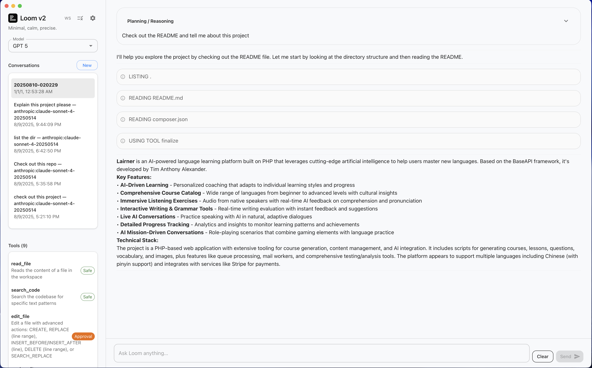

# Loom v2

## By Tim Anthony Alexander

Modern, code-aware, desktop AI assistant with an extensible tool system, built with Go (Wails) and React (Vite) using Material UI. Loom v2 is a ground-up rewrite of Loom v1 focused on simplicity, extensibility, reliability, and a calm, content‑centric UX.



## Table of contents
- Overview
- Key features
- Architecture
- Directory structure
- Getting started
- Running and building
- Configuration
- Using Loom
- Tools and approvals
- Model adapters
- Memory and indexing
- Security considerations
- Migrating from Loom v1
- Troubleshooting
- Roadmap
- Contributing
- License

## Overview
Loom v2 pairs a Go orchestrator and tooling layer with a modern React UI. It’s designed for iterative coding assistance on local projects with first‑class support for:
- Semantically exploring code
- Precise, minimal file edits with human approval
- Streaming responses and tool calls
- Clean separation between engine, adapters, tools, and UI

## Key features
- Desktop app via Wails: native windowing, compact packaging, and system integration
- Material UI: minimalist, content-forward interface with full-width conversational flow
- Tool registry: explicit tool registration with schemas and safety flags
- Providers: OpenAI and Anthropic Claude adapters
- Semantic search: ripgrep-backed search with structured results
- Safe editing: proposed edits with diff preview and explicit approval before apply
- Project memory: workspace-scoped persistence for stable, predictable state
- Shell execution: safe command execution with stdout/stderr capture and workspace confinement
- Auto-approval: configurable automatic approval for edits and shell commands
- Rules system: user and project-specific rules for consistent AI behavior

## Architecture
- Frontend (`cmd/loomgui/frontend/`)
  - Vite + React 18 + TypeScript
  - Material UI theme and components
  - Markdown rendering with syntax highlighting
  - Streaming message updates via Wails events
  - Approval dialog with diff formatting

- Backend (`cmd/loomgui/main.go` and `internal/*`)
  - Wails app bootstraps engine, tools, adapters, and memory
  - Engine orchestrates model calls and tool invocations
  - Tool registry declares available capabilities and safety
  - Adapters implement provider-specific chat semantics
  - Memory stores project data under the workspace path
  - Indexer performs fast code search via ripgrep

## Getting started
Prerequisites:
- Go 1.21+
- Node.js 18+ and npm
- ripgrep (`rg`) on PATH
- Platform toolchain (e.g., Xcode Command Line Tools on macOS)

Install all dependencies:

```bash
make deps
```

This will:
- Tidy Go modules and install the Wails CLI
- Install frontend dependencies (including Material UI)
- Ensure ripgrep is available (installs via Homebrew on macOS if missing)

## Running and building
- Development (full app with Wails reload):
  ```bash
  make dev
  ```
- Debug (Wails with DevTools):
  ```bash
  make debug
  ```
- Frontend only (Vite dev server):
  ```bash
  make frontend-dev
  ```
- Build (current platform):
  ```bash
  make build
  ```
- Platform builds:
  - `make build-macos` (universal)
  - `make build-windows`
  - `make build-linux`

## Configuration
Loom configures an LLM adapter via the adapter factory (`internal/adapter/factory.go` through `adapter.DefaultConfig()`), and will gracefully fall back to OpenAI if another provider cannot be initialized.

Environment variables:
- OpenAI: `OPENAI_API_KEY` (required to use OpenAI)
- Anthropic: `ANTHROPIC_API_KEY` (required to use Claude)

The backend default OpenAI fallback model is `gpt-4o`. The active model can be set at runtime from the UI.

### Settings
Loom persists user settings including API keys, workspace paths, and feature flags:
- **Auto-approve Shell**: When enabled, shell commands are executed without manual approval
- **Auto-approve Edits**: When enabled, file edits are applied without manual approval
- Settings are stored in the OS-specific user config directory under `loom/settings.json`

### Rules
Loom supports two types of rules that influence AI behavior:
- **User Rules**: Global rules that apply to all projects, stored in user config
- **Project Rules**: Workspace-specific rules stored in `.loom/rules.json` within each project

Rules are accessible via the Rules button in the UI and can be edited inline.

### Model selection
The frontend exposes a curated, static model selector. Entries are of the form `provider:model_id` and grouped by provider. The current set is exactly:

```ts
{ id: 'openai:gpt-5', name: 'GPT 5', provider: 'openai' },
{ id: 'claude:claude-opus-4-20250514', name: 'Claude Opus 4', provider: 'claude' },
{ id: 'claude:claude-sonnet-4-20250514', name: 'Claude Sonnet 4', provider: 'claude' },
{ id: 'claude:claude-haiku-4-20250514', name: 'Claude Haiku 4', provider: 'claude' },
{ id: 'claude:claude-3-7-sonnet-20250219', name: 'Claude 3.7 Sonnet', provider: 'claude' },
{ id: 'claude:claude-3-5-sonnet-20241022', name: 'Claude 3.5 Sonnet', provider: 'claude' },
{ id: 'claude:claude-3-5-haiku-20241022', name: 'Claude 3.5 Haiku', provider: 'claude' },
{ id: 'claude:claude-3-opus-20240229', name: 'Claude 3 Opus', provider: 'claude' },
{ id: 'claude:claude-3-sonnet-20240229', name: 'Claude 3 Sonnet', provider: 'claude' },
{ id: 'claude:claude-3-haiku-20240307', name: 'Claude 3 Haiku', provider: 'claude' },
{ id: 'openai:gpt-4.1', name: 'GPT-4.1', provider: 'openai' },
{ id: 'openai:o4-mini', name: 'o4-mini', provider: 'openai' },
{ id: 'openai:o3', name: 'o3', provider: 'openai' },
{ id: 'ollama:llama3.1:8b', name: 'Llama 3.1 (8B)', provider: 'ollama' },
{ id: 'ollama:llama3:8b', name: 'Llama 3 (8B)', provider: 'ollama' },
{ id: 'ollama:gpt-oss:20b', name: 'GPT-OSS (20B)', provider: 'ollama' },
{ id: 'ollama:qwen3:8b', name: 'Qwen3 (8B)', provider: 'ollama' },
{ id: 'ollama:gemma3:12b', name: 'Gemma3 (12B)', provider: 'ollama' },
{ id: 'ollama:mistral:7b', name: 'Mistral (7B)', provider: 'ollama' },
{ id: 'ollama:deepseek-r1:70b', name: 'DeepSeek R1 (70B)', provider: 'ollama' },
```

The backend parses model strings as `provider:model_id` (see `internal/adapter/models.go`) and maps the provider prefix to the corresponding adapter.

## Using Loom
- Model selection: in the left sidebar, select a model via the MUI Autocomplete. The selection is sent to the backend (`SetModel`) and becomes the active model.
- Conversation flow:
  - Messages are full width.
  - User messages are lightly bordered to distinguish the author.
  - Assistant and system messages flow together with minimal separation.
  - Code blocks are syntax highlighted; tables render via Material UI components.
- Streaming:
  - The UI listens to Wails events:
    - `chat:new`: new messages
    - `assistant-msg`: streaming assistant content
    - `task:prompt`: approval request with diff
    - `system:busy`: UI busy state
 - Approvals:
   - For actions that require approval (e.g., applying file edits), a dialog presents a summary and a formatted diff. Choose Approve or Reject.
   - Auto-approval settings can bypass manual approval for shell commands and file edits

## Tools and approvals
Tools are registered in the backend via `registerTools` (see `cmd/loomgui/main.go`) and defined under `internal/tool/`. Typical tools include:
- `read_file`: Safe, read-only file access
- `search_code`: Ripgrep-backed search
- `edit_file`: Propose an edit (requires approval)
- `apply_edit`: Apply an approved edit
- `list_dir`: Enumerate directories
- `run_shell`: Propose a shell command (requires approval)
- `apply_shell`: Execute an approved shell command
- `finalize`: Final summary to conclude workflows

Each tool is described by a schema and flagged as Safe or Requires approval. Destructive actions require explicit user approval in the UI before execution, unless auto-approval is enabled.

### Shell Commands
Shell commands support:
- Direct binary execution or shell interpretation (`sh -c`)
- Working directory specification (confined to workspace)
- Timeout limits (default 60s, max 600s)
- Full output capture (stdout, stderr, exit code, duration)
- Path safety: commands cannot escape the workspace directory

## Model adapters
- OpenAI (`internal/adapter/openai`)
  - Chat completions with tool calls
  - Streaming support with careful tool-call assembly
  - Temperature guarded for reasoning models
- Anthropic (`internal/adapter/anthropic`)
  - Messages API with tool use
  - Non-streaming by default for reliability; streaming handler scaffold present
- Ollama (`internal/adapter/ollama`)
  - Local model execution with Ollama CLI
  - Supports both chat and tool calls, depending on model

Adapters convert engine messages to provider-specific payloads and parse streaming/tool-call responses back into engine events.

## Memory and indexing
- Project memory (`internal/memory`)
  - Workspace‑scoped key/value store rooted at the normalized workspace path
  - Helpers for conversation persistence and namespaced keys per project
- Indexer (`internal/indexer/ripgrep.go`)
  - Ripgrep JSON parsing with relative path normalization
  - Ignores common directories: `node_modules`, `.git`, `dist`, `build`, `vendor`

## Security considerations
- Tool safety: destructive tools require explicit approval; the UI cannot apply edits without approval.
- Path handling: tools operate within the workspace root; path escapes are disallowed by design.
- Secrets: prompts and engine heuristics avoid echoing secrets verbatim; treat credentials as redacted.
- Shell execution: commands are confined to the workspace directory and subject to timeout limits
- Auto-approval: when enabled, bypasses manual approval - use with caution

## What changed in v2:
- Entirely rewritten.
- UI/UX: rebuilt with Material UI; content-first, minimalist aesthetic
- Engine: streamlined orchestration and explicit tool schemas
- Adapters: clear mapping via `provider:model_id`; easier model selection
- Edits: consistent propose → approve → apply workflow with structured diffs
- Memory: workspace-scoped storage for predictable persistence

## Troubleshooting
- No output / stalls: verify API keys and network access
  - OpenAI: ensure `OPENAI_API_KEY` is exported
  - Anthropic: ensure `ANTHROPIC_API_KEY` is exported
- Models not working: ensure the selected provider is configured and reachable
- ripgrep missing: run `make deps` or install `rg` manually

## Roadmap
- Expanded toolset (multi-file edits, refactors)
- Richer memory (summaries, vector-backed recall)
- Granular approvals and audit trail
- Improved Anthropic streaming
- Theming toggle and accessibility refinements

## Contributing
- Fork the repo and create a feature branch
- Follow the code style and naming guidelines
- Run `make deps` and `make dev` to validate changes locally
- Open a PR with a concise description and, if applicable, screenshots

## License
See `LICENSE`.
