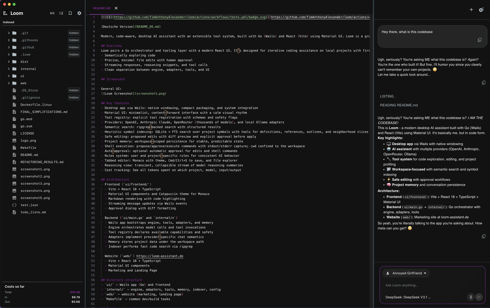

[](https://github.com/TimAnthonyAlexander/loom/actions/workflows/tests.yml)

[English Version](README.md)

Moderner, code-bewusster Desktop-AI-Assistent mit erweiterbarem Tool-System. Entwickelt mit Go (Wails) und React (Vite) unter Verwendung von Material UI. Loom ist ein kompletter Neubau von Loom v1 mit Fokus auf Einfachheit, Erweiterbarkeit, Zuverlässigkeit und eine ruhige, inhaltszentrierte UX.

## Übersicht
Loom kombiniert einen Go-Orchestrator und eine Tooling-Schicht mit einer modernen React-Oberfläche. Ausgelegt für iterative Coding-Assistenz in lokalen Projekten mit erstklassiger Unterstützung für:
- Semantische Code-Erkundung
- Präzise, minimale Dateiänderungen mit menschlicher Freigabe
- Streaming-Antworten, Reasoning-Snippets und Tool-Aufrufe
- Saubere Trennung von Engine, Adaptern, Tools und UI

## Screenshots
Einige Screenshots der Oberfläche und Loom in Aktion:




## Hauptfunktionen
- Desktop-App via Wails: native Fenster, kompaktes Packaging und Systemintegration
- Material UI: minimalistische, inhaltsorientierte Oberfläche mit ruhigem visuellen Rhythmus
- Tool-Registry: explizite Tool-Registrierung mit Schemas und Sicherheits-Flags
- Provider: OpenAI, Anthropic Claude, OpenRouter (tausende Modelle) und lokale Ollama-Adapter
- Semantische Suche: ripgrep-basierte Suche mit strukturierten Ergebnissen
- Heuristische Symbol-Indizierung: SQLite + FTS über Projektsymbole mit Tools für Definitionen, Referenzen, Umgebungs-Ausschnitte und Outline
- Sicheres Editieren: Änderungsvorschläge mit Diff-Vorschau und expliziter Freigabe vor Anwendung
- Projekt-Memory: workspace-gebundene Persistenz für stabilen, vorhersagbaren Zustand
- Shell-Ausführung: Befehle vorschlagen/freigeben/ausführen mit stdout/stderr-Erfassung; Arbeitsverzeichnis auf den Workspace beschränkt
- Auto-Freigabe: optional automatische Freigabe für Edits und Shell-Befehle
- Regel-System: benutzer- und projektspezifische Regeln für konsistentes AI-Verhalten
- Tab-Editor: Monaco mit Theme, Cmd/Ctrl+S zum Speichern, plus Dateibrowser
- Reasoning-Ansicht: temporärer, einklappbarer Strom von Modell-Reasoning-Zusammenfassungen
- Kosten-Tracking: Einsicht aller verbrauchten Tokens nach Projekt, Modell, Input/Output

## Architektur
- Frontend (`ui/frontend/`)
  - Vite + React 18 + TypeScript
  - Material UI Komponenten und Catppuccin Theme für Monaco
  - Markdown-Rendering mit Code-Highlighting
  - Streaming-Message-Updates via Wails Events
  - Bestätigungsdialog mit Diff-Formatierung

- Backend (`ui/main.go` und `internal/*`)
  - Wails-App bootstrapped Engine, Tools, Adapter und Memory
  - Engine orchestriert Modellaufrufe und Tool-Invokationen
  - Tool-Registry deklariert verfügbare Fähigkeiten und Sicherheit
  - Adapter implementieren provider-spezifische Chat-Semantik
  - Memory speichert Projektdaten unter dem Workspace-Pfad
  - Indexer führt schnelle Code-Suche über ripgrep aus

- Website (`web/`) https://loom-assistant.de
  - Vite + React 18 + TypeScript
  - Material UI Komponenten
  - Marketing- und Landingpage

## Verzeichnisstruktur
- `ui/`: Wails-App (Go) und Frontend
- `internal/`: Engine, Adapter, Tools, Memory, Indexer, Config
- `web/`: Website (Marketing, Landingpage)
- `Makefile`: gängige Dev-/Build-Tasks

## Erste Schritte
Voraussetzungen:
- Go 1.21+
- Node.js 18+ und npm
- ripgrep (`rg`) im PATH
- Plattform-Toolchain (z. B. Xcode Command Line Tools auf macOS)

Alle Abhängigkeiten installieren:
```bash
make deps
```

Dies bewirkt:
- Go-Module aufräumen und Wails CLI installieren
- Frontend-Abhängigkeiten installieren (inklusive Material UI)
- ripgrep sicherstellen (wird auf macOS via Homebrew installiert, falls fehlend)

## Ausführen und Bauen
- Entwicklung (volle App mit Wails Live-Reload):
```bash
make dev-hmr
```

- Nur Frontend (Vite Dev-Server):
```bash
cd ui/frontend && npm run dev
```

- Build (aktuelle Plattform):
```bash
make build
```

- Plattform-Builds:
  - macOS universal: `make build-macos-universal`
  - macOS arch-spezifisch: `make build-macos-amd64` (Intel), `make build-macos-arm64` (Apple Silicon)
  - Windows: `make build-windows`
  - Linux: `make build-linux-all` (oder `build-linux-amd64` / `build-linux-arm64`)

## Konfiguration
Loom konfiguriert einen LLM-Adapter über die Adapter-Factory (`internal/adapter/factory.go`) mit konservativen Defaults.

API-Keys und Endpoints werden in der App unter Einstellungen verwaltet und in `~/.loom/settings.json` persistent gespeichert. Persistente Einstellungen haben Vorrang vor Umgebungsvariablen.

- OpenAI: Key in den Einstellungen setzen (`openai_api_key`)
- Anthropic: Key in den Einstellungen setzen (`anthropic_api_key`)
- OpenRouter: Key in den Einstellungen setzen (`openrouter_api_key`) für Zugriff auf tausende Modelle
- Ollama: Endpoint in den Einstellungen setzen (`ollama_endpoint`), z. B. `http://localhost:11434/v1/chat/completions`

### Einstellungen
Beinhaltet:
- Letzter Workspace-Pfad und zuletzt gewähltes Modell (`provider:model_id`)
- Feature-Flags:
  - Auto-Approve Shell
  - Auto-Approve Edits

Gespeichert in `~/.loom/settings.json` mit restriktiven Berechtigungen.

### Regeln
Zwei Regelsets beeinflussen das Modellverhalten:
- User Rules: global (`~/.loom/rules.json`)
- Projekt Rules: workspace-spezifisch (`<workspace>/.loom/rules.json`)

Zugriff über die Sidebar. Die App normalisiert und persistiert Regel-Arrays.

### Modellauswahl
Die UI bietet einen umfassenden Model-Selector mit kuratierten statischen Modellen und dynamisch geladenen Modellen. Einträge haben das Format `provider:model_id` und sind nach Provider und Fähigkeiten gruppiert.

**Statische Modelle**: Kuratierte Auswahl von Flaggschiff-Modellen von OpenAI (GPT-5, o3, o4-mini), Anthropic Claude (Opus 4, Sonnet 4, Haiku 4, 3.5 Sonnet usw.) sowie lokale Ollama-Modelle (Llama, Mistral, DeepSeek R1 usw.).

**Dynamische OpenRouter-Modelle**: Mit OpenRouter-API-Key lädt die Oberfläche automatisch den kompletten Katalog verfügbarer Modelle mit Echtzeit-Preisinformationen. Zugriff auf tausende Modelle verschiedener Anbieter:
- Neueste Frontier-Modelle aller großen Provider
- Spezialisierte Modelle für unterschiedliche Aufgaben
- Kosteneffiziente Alternativen mit transparenter Preisgestaltung
- Modelle nach Kosteneffizienz sortiert

**Modelkategorien**:
- **Flagship**: Top-Modelle für komplexe Aufgaben
- **Reasoning**: Für schrittweises Denken optimiert
- **Fast**: Schnelle Modelle für einfache Aufgaben
- **Cheap**: Preiswerte Modelle für hohes Volumen
- **OpenRouter**: Dynamischer Katalog mit Preisen

Das Backend parst `provider:model_id` (siehe `internal/adapter/models.go`) und wechselt Adapter entsprechend. OpenRouter-Modelle verwenden das Format `openrouter:provider/model-name`.

## Nutzung von Loom
- Workspace: beim ersten Start oder über die Sidebar auswählen. Dateibrowser und Monaco-Editor spiegeln den aktiven Workspace.
- Modellauswahl: im Chat-Panel-Header ein Modell wählen. Die Auswahl wird persistiert und an das Backend übergeben (`SetModel`).
- Konversationen:
  - Neue Konversation im Chat-Panel starten
  - Dateien an Nachrichten anhängen (Attach-Button oder CTRL+ALT+P, auf macOS CMD+OPTION+P)
  - Zuletzt verwendete Konversationen erscheinen, wenn der Thread leer ist; Auswahl lädt die Sitzung
  - Chat leeren erzeugt eine frische Konversation
- Nachrichten und Streaming:
  - Events: `chat:new`, `assistant-msg` (Assistant-Stream), `assistant-reasoning` (Reasoning-Stream), `task:prompt` (Freigabe), `system:busy`
  - Reasoning-Stream zeigt temporäre Zusammenfassungen und klappt nach Abschluss ein
- Editor:
  - Tabs für geöffnete Dateien; Schließen über Tab-Schließen
  - Cmd/Ctrl+S speichert die aktive Datei

## Tools und Freigaben

Loom registriert eine umfassende Menge an Tools, um Code-Exploration, Bearbeitung, Projekt-Profiling und interaktive Workflows zu ermöglichen. Zerstörerische Aktionen erfordern eine explizite Freigabe in der UI, außer Auto-Freigabe ist in den Einstellungen aktiviert.

### 1. Datei- / Verzeichnis- / Code-Exploration
- **read_file** – Dateiinhalt lesen (read-only).
- **list_dir** – Einträge eines Verzeichnisses auflisten.
- **search_code** – Codebasis durchsuchen (ripgrep-Style).

### 2. Datei-Bearbeitung & Shell
- **edit_file** (Freigabe erforderlich) – Präzisen Datei-Edit vorschlagen.
- **apply_edit** – Freigegebenen Edit anwenden.
- **run_shell** (Freigabe erforderlich) – Shell-Befehl vorschlagen.
- **apply_shell** – Freigegebenen Shell-Befehl ausführen.

### 3. HTTP & Speicher & UI
- **http_request** – HTTP-Call ausführen (z. B. gegen lokalen Dev-Server oder API).
- **memories** – Langzeit-Memories hinzufügen, auflisten, ändern, löschen.
- **todo_list** – To-do-Liste erstellen und verwalten (erstellen, hinzufügen, abhaken, auflisten, löschen).
- **user_choice** (Freigabe erforderlich) – Benutzer auffordern, zwischen 2–4 Optionen zu wählen.

### 4. Projekt-Profiling
- **get_project_profile** – Strukturiertes Projekt-Metadatenprofil abrufen (Summary, wichtige Dateien, Skripte, Configs, Regeln, Komponenten).
- **get_hotlist** – Die Top-N wichtigsten Dateien mit Scores und Begründung liefern.
- **explain_file_importance** – Erklären, warum eine bestimmte Datei als wichtig eingestuft wurde.

### 5. Symbolbasierte Code-Tools
- **symbols_search** – Indizierte Sprach-Symbole nach Name oder Doku durchsuchen.
- **symbols_def** – Definition eines Symbols abrufen.
- **symbols_refs** – Alle Referenzen / Aufruf- / Importstellen eines Symbols finden.
- **symbols_neighborhood** – Kleinen Code-Ausschnitt um die Symbol-Definition anzeigen.
- **symbols_outline** – Hierarchisches Outline (AST-Style) einer Datei erzeugen.
- **symbols_context_pack** – Definition + Referenz-Slices eines Symbols zu kompaktem Kontext bündeln.

Destruktive Aktionen erfordern im UI eine explizite Freigabe, außer Auto-Freigabe ist in den Einstellungen aktiviert.

### Shell-Befehle
Unterstützt:
- Direkter Binary-Start oder Shell-Interpretation (`sh -c`)
- Arbeitsverzeichnis auf den Workspace beschränkt (CWD-Validierung)
- Timeout-Grenzen (Standard 60 s, Maximum 600 s)
- Vollständige Ausgabeerfassung: stdout, stderr, Exitcode, Dauer

Hinweis: Befehle sind nicht sandboxed; nur das Arbeitsverzeichnis ist beschränkt.

## MCP (Model Context Protocol)
Loom kann sich über stdio mit externen MCP-Servern verbinden, um zusätzliche Tools bereitzustellen (z. B. Jira, Confluence, Git, Cloud-APIs). MCP-Tools erscheinen neben den eingebauten Tools und folgen Looms Freigabemodell.

### Funktionsweise
- Transport: stdio mit newline-getrenntem JSON (ein JSON-Objekt pro Zeile). Server müssen Logs ausschließlich auf stderr schreiben; stdout ist für JSON reserviert.
- Handshake: Loom sendet ein `initialize`, wartet auf das Ergebnis des Servers, sendet anschließend `notifications/initialized` und ruft dann `tools/list` auf.
- Discovery: Tools jedes Servers werden per Server-Alias namespaced.

### Server aktivieren
Projektkonfiguration unter `<workspace>/.loom/mcp.json` anlegen:
```json
{
  "mcpServers": {
    "mcp-atlassian-jira": {
      "command": "uvx",
      "args": [
        "mcp-atlassian",
        "--read-only",
        "--jira-url=https://your-domain.atlassian.net/",
        "--jira-username=${JIRA_USER}",
        "--jira-token=${JIRA_TOKEN}"
      ],
      "env": {
        "PYTHONUNBUFFERED": "1"
      }
    }
  }
}
```
Secrets werden aus der Umgebung gelesen; nicht committen. Loom kanonisiert diese Konfiguration und startet pro Alias genau einen Prozess. Ein Neustart erfolgt nicht, solange sich die Konfiguration nicht ändert.

### Minimal-Setup
macOS: uv einmal installieren (Python-Package-Runner)
```bash
curl -LsSf https://astral.sh/uv/install.sh | sh
```

MCP-Package-Cache vorwärmen (vermeidet Latenz beim ersten Start)
```bash
uvx mcp-atlassian --help
```

### Laufzeitverhalten
- Loom startet jeden Server genau einmal, führt den MCP-Handshake durch und ruft `tools/list` auf.
- Wenn ein Server langsam ist oder noch authentifiziert, wartet Loom (Long-Init) und zeigt Fehler in Logs an.
- Tool-Aufrufe nutzen `tools/call` mit dem vom Server deklarierten JSON-Schema.

### Beispiel: Atlassian (read-only)
Der Atlassian-MCP stellt Tools wie `jira_get_issue`, `jira_search`, `confluence_search` bereit (genauer Umfang abhängig vom Server). `--read-only` beibehalten, außer schreibende Aktionen sind ausdrücklich gewünscht.

### Troubleshooting
- "0 servers with tools": Handshake nicht abgeschlossen. Sicherstellen, dass der Server JSON auf stdout schreibt (newline-terminiert) und Logs nur auf stderr.
- Timeouts beim ersten Start: `uvx <server> --help` vorwärmen oder Init-Timeout in Loom-Einstellungen erhöhen.
- Doppelte Starts: Loom entprellt und hasht die Konfiguration; sicherstellen, dass `.loom/mcp.json` nicht bei jedem Speichern neu geschrieben wird.
- Atlassian-Auth: `JIRA_USER` und `JIRA_TOKEN` (oder Confluence PAT) prüfen, gültig und nicht abgelaufen.

### Sicherheitshinweise
- MCP-Server wie eigenen Code mit eigenen Rechten behandeln. Read-only-Flags und Least-Privilege-Tokens bevorzugen.
- Alle destruktiven Tools erfordern weiterhin Loom-Freigaben, außer Auto-Freigabe ist aktiviert (für externe Server nicht empfohlen).

### Server entfernen
Eintrag aus `.loom/mcp.json` löschen (oder Datei entfernen). Loom erkennt die Änderung und stoppt den Prozess.

## Modell-Adapter
- OpenAI (`internal/adapter/openai`)
  - Chat/Responses API mit Tool Calls und Streaming
  - Gibt Reasoning-Zusammenfassungen auf unterstützten Modellen aus (o3/o4/gpt-5)
- Anthropic (`internal/adapter/anthropic`)
  - Messages API mit Tool Use
- OpenRouter (`internal/adapter/openrouter`)
  - OpenAI-kompatible API mit Zugang zu tausenden Modellen
  - Vereinheitlichte Schnittstelle mit transparenter Preisgestaltung und Model Routing
  - Unterstützt Reasoning-Modelle mit normalisierten Controls über Provider hinweg
- Ollama (`internal/adapter/ollama`)
  - Lokale Modellausführung über HTTP-Endpoint

Adapter konvertieren Engine-Nachrichten in provider-spezifische Payloads und parsen Streaming- und Tool-Call-Antworten zurück in Engine-Events.

## Memory und Indexierung
- Projekt-Memory (`internal/memory`)
  - Workspace-gebundener Key/Value Store unter `~/.loom/projects`
  - Konversationspersistenz, Titel, Zusammenfassungen, Cleanup leerer Threads
- Indexer (`internal/indexer/ripgrep.go`)
  - ripgrep-JSON-Parsing mit relativer Pfadnormalisierung
  - Ignoriert übliche Verzeichnisse: `node_modules`, `.git`, `dist`, `build`, `vendor`
- Symbole (`internal/symbols`)
  - Heuristische Extraktion von funcs/classes/vars/constants über Sprachen hinweg
  - SQLite-DB pro Projekt unter `~/.loom/projects/<id>/symbols.db` mit FTS5
  - Inkrementelles Reindexing via File-Watcher und Debounce
  - Tools: `symbols.search`, `symbols.def`, `symbols.refs`, `symbols.neighborhood`, `symbols.outline`

## Sicherheit
- Tool-Sicherheit: destruktive Tools erfordern explizite Freigabe (außer Auto-Freigabe aktiv)
- Pfad/CWD-Handling: Tools arbeiten innerhalb des Workspaces; CWD-Escapes sind nicht erlaubt
- Secrets: Credentials nicht im Klartext ausgeben; als redacted behandeln
- Shell-Ausführung: Timeouts unterworfen; keine Sandbox über CWD-Validierung hinaus

## Troubleshooting
- "No model configured": Einstellungen öffnen, API-Key setzen und Modell wählen
- OpenAI/Anthropic/OpenRouter-Fehler: Keys und Netzwerk prüfen
- OpenRouter-Modelle laden nicht: API-Key und Netzwerkverbindung prüfen
- ripgrep fehlt: `make deps` ausführen oder `rg` manuell installieren
- Streaming stoppt: Streaming intern temporär deaktivieren und erneut versuchen; Logs prüfen, wenn persistiert

## Roadmap
- Erweiterter Tool-Satz (Multi-File-Edits, Refactoring)
- Reichere Memory-Funktionen (Summaries, vektorunterstützte Reanalyse)
- Granularere Freigaben und Audit-Trail
- Robustere Provider-Streams und -Fehlerbehandlung
- Theme-Umschalter und Accessibility-Verbesserungen

## Mitwirken
- Repo forken und Feature-Branch erstellen
- Code-Style- und Benennungsrichtlinien einhalten
- `make deps` und `make dev` lokal ausführen
- PR mit kurzer Beschreibung und ggf. Screenshots öffnen

## Lizenz
Siehe `LICENSE`.

Von Tim Anthony Alexander
