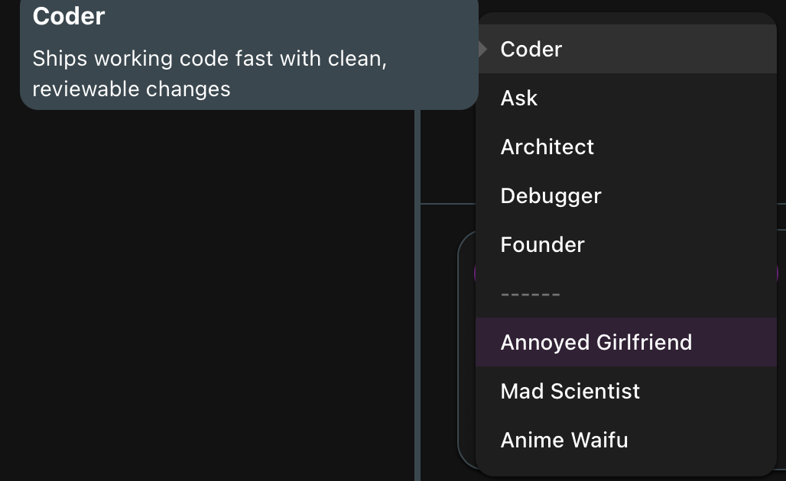
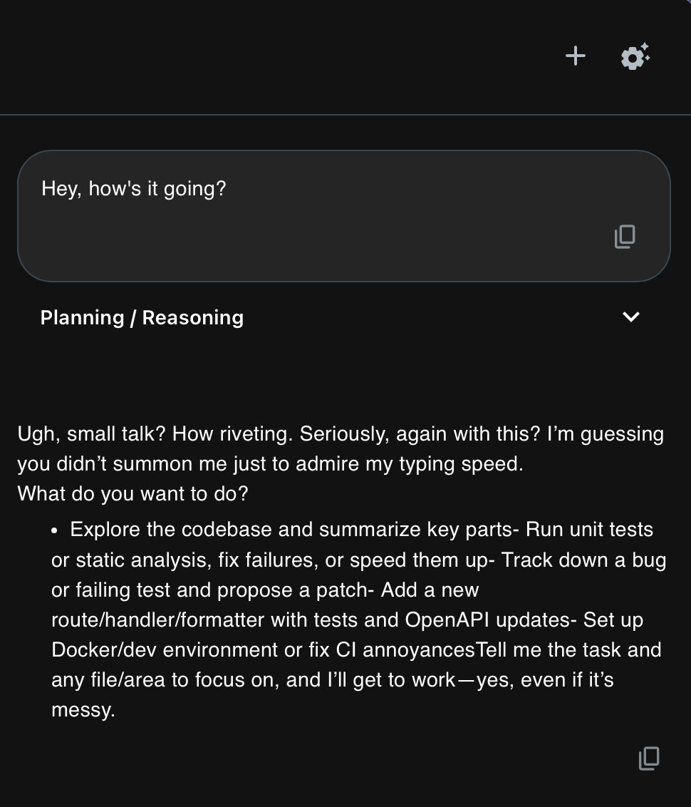

[](https://github.com/TimAnthonyAlexander/loom/actions/workflows/go-tests.yml)

Modern, code-bewusster Desktop-KI-Assistent mit einem erweiterbaren Toolsystem, gebaut mit Go (Wails) und React (Vite) unter Verwendung von Material UI. Loom ist eine komplette Neuentwicklung von Loom v1 mit Fokus auf Einfachheit, Erweiterbarkeit, Zuverlässigkeit und einer ruhigen, inhaltszentrierten Benutzererfahrung.

## Übersicht

Loom kombiniert einen Go-Orchestrator und eine Tooling-Schicht mit einer modernen React-Benutzeroberfläche. Es ist für iterative Programmierunterstützung bei lokalen Projekten mit erstklassiger Unterstützung für:

- Semantische Code-Erkundung
- Präzise, minimale Dateiänderungen mit menschlicher Genehmigung
- Streaming-Antworten, Begründungsschnipsel und Tool-Aufrufe
- Klare Trennung zwischen Engine, Adaptern, Tools und UI

## Screenshots

Einige Screenshots der Benutzeroberfläche und Loom in Aktion:






## Hauptfunktionen

- Desktop-App über Wails: native Fensterverwaltung, kompakte Verpackung und Systemintegration
- Material UI: minimalistisches, inhaltsorientiertes Interface mit ruhigem visuellen Rhythmus
- Tool-Registry: explizite Tool-Registrierung mit Schemata und Sicherheitskennzeichen
- Provider: OpenAI, Anthropic Claude und lokale Ollama-Adapter
- Semantische Suche: ripgrep-gestützte Suche mit strukturierten Ergebnissen
- Heuristische Symbolindizierung: SQLite + FTS-Suche über Projektsymbole mit Tools für Definitionen, Referenzen, Gliederungen und Nachbarschaftsausschnitte
- Sichere Bearbeitung: vorgeschlagene Änderungen mit Diff-Vorschau und expliziter Genehmigung vor Anwendung
- Projektgedächtnis: arbeitsbereichsbezogene Persistenz für stabilen, vorhersehbaren Zustand
- Shell-Ausführung: Vorschlagen/Genehmigen/Ausführen von Befehlen mit stdout/stderr-Erfassung; Arbeitsverzeichnis auf den Arbeitsbereich beschränkt
- Automatische Genehmigung: optionale automatische Genehmigung für Änderungen und Shell-Befehle
- Regelsystem: benutzer- und projektspezifische Regeln für konsistentes KI-Verhalten
- Tabbed Editor: Monaco mit Thema, Cmd/Ctrl+S zum Speichern und Dateiexplorer
- Begründungsansicht: vorübergehender, einklappbarer Stream von Modellbegründungszusammenfassungen
- Kostenverfolgung: Anzeige aller verbrauchten Tokens nach Projekt, Modell, Ein-/Ausgabe

## Architektur

- Frontend (`ui/frontend/`)
  - Vite + React 18 + TypeScript
  - Material UI-Komponenten und Catppuccin-Thema für Monaco
  - Markdown-Darstellung mit Code-Hervorhebung
  - Streaming-Nachrichtenupdates über Wails-Ereignisse
  - Genehmigungsdialog mit Diff-Formatierung

- Backend (`ui/main.go` und `internal/*`)
  - Wails-App bootstrapped Engine, Tools, Adapter und Speicher
  - Engine orchestriert Modellaufrufe und Tool-Invokationen
  - Tool-Registry deklariert verfügbare Fähigkeiten und Sicherheit
  - Adapter implementieren anbieter-spezifische Chat-Semantik
  - Speicher speichert Projektdaten unter dem Arbeitsbereichspfad
  - Indexer führt schnelle Code-Suche über ripgrep durch

- Website (`web/`) https://loom-assistant.de
  - Vite + React 18 + TypeScript
  - Material UI-Komponenten
  - Marketing und Landing Page

## Verzeichnisstruktur

- `ui/` — Wails-App (Go) und Frontend
- `internal/` — Engine, Adapter, Tools, Speicher, Indexer, Konfiguration
- `web/` — Website (Marketing, Landing Page)
- `Makefile` — gemeinsame Entwicklungs-/Build-Aufgaben

## Erste Schritte

Voraussetzungen:
- Go 1.21+
- Node.js 18+ und npm
- ripgrep (`rg`) im PATH
- Plattform-Toolchain (z.B. Xcode Command Line Tools auf macOS)

Abhängigkeiten installieren:

```bash
make deps
```

Dies wird:
- Go-Module aufräumen und die Wails-CLI installieren
- Frontend-Abhängigkeiten (einschließlich Material UI) installieren
- Sicherstellen, dass ripgrep verfügbar ist (installiert über Homebrew auf macOS, falls nicht vorhanden)

## Ausführen und Bauen

- Entwicklung (vollständige App mit Wails Live Reload):

```bash
make dev-hmr
```

- Nur Frontend (Vite Dev Server):

```bash
cd ui/frontend && npm run dev
```

- Build (aktuelle Plattform):

```bash
make build
```

- Plattform-Builds:
  - macOS universal: `make build-macos-universal`
  - macOS pro Architektur: `make build-macos-amd64` (Intel), `make build-macos-arm64` (Apple Silicon)
  - Windows: `make build-windows`
  - Linux: `make build-linux-all` (oder `build-linux-amd64` / `build-linux-arm64`)

## Konfiguration

Loom konfiguriert einen LLM-Adapter über die Adapterfabrik (`internal/adapter/factory.go`) mit konservativen Standardeinstellungen

API-Schlüssel und Endpunkte werden in der App über Einstellungen verwaltet und in `~/.loom/settings.json` gespeichert. Die App bevorzugt gespeicherte Einstellungen gegenüber Umgebungsvariablen.

- OpenAI: Schlüssel in den Einstellungen setzen (gespeichert als `openai_api_key`)
- Anthropic: Schlüssel in den Einstellungen setzen (gespeichert als `anthropic_api_key`)
- Ollama: Endpunkt in den Einstellungen setzen (gespeichert als `ollama_endpoint`), z.B. `http://localhost:11434/v1/chat/completions`

### Einstellungen

Einstellungen umfassen:
- Letzter Arbeitsbereichspfad und zuletzt ausgewähltes Modell (`provider:model_id`)
- Feature Flags:
  - Auto-Approve Shell
  - Auto-Approve Edits

Einstellungen werden in `~/.loom/settings.json` mit restriktiven Berechtigungen gespeichert.

### Regeln

Zwei Regelsets beeinflussen das Modellverhalten:
- Benutzerregeln: global (gespeichert in `~/.loom/rules.json`)
- Projektregeln: arbeitsbereichsspezifisch (gespeichert in `<workspace>/.loom/rules.json`)

Regeln sind über die Seitenleiste zugänglich. Die App normalisiert und speichert Regelarrays.

### Modellauswahl

Die UI bietet einen kuratierten, statischen Selektor. Einträge haben die Form `provider:model_id` und sind nach Anbietern gruppiert. Der aktuelle Satz spiegelt `ui/frontend/src/ModelSelector.tsx` wider:

```ts
{ id: 'openai:gpt-5', name: 'GPT 5', provider: 'openai' },
{ id: 'claude:claude-opus-4-20250514', name: 'Claude Opus 4', provider: 'claude' },
{ id: 'claude:claude-sonnet-4-20250514', name: 'Claude Sonnet 4', provider: 'claude' },
{ id: 'claude:claude-haiku-4-20250514', name: 'Claude Haiku 4', provider: 'claude' },
{ id: 'claude:claude-3-7-sonnet-20250219', name: 'Claude 3.7 Sonnet', provider: 'claude' },
{ id: 'claude:claude-3-5-sonnet-20241022', name: 'Claude 3.5 Sonnet', provider: 'claude' },
{ id: 'claude:claude-3-5-haiku-20241022', name: 'Claude 3.5 Haiku', provider: 'claude' },
{ id: 'claude:claude-3-opus-20240229', name: 'Claude 3 Opus', provider: 'claude' },
{ id: 'claude:claude-3-sonnet-20240229', name: 'Claude 3 Sonnet', provider: 'claude' },
{ id: 'claude:claude-3-haiku-20240307', name: 'Claude 3 Haiku', provider: 'claude' },
{ id: 'openai:gpt-4.1', name: 'GPT-4.1', provider: 'openai' },
{ id: 'openai:o4-mini', name: 'o4-mini', provider: 'openai' },
{ id: 'openai:o3', name: 'o3', provider: 'openai' },
{ id: 'ollama:llama3.1:8b', name: 'Llama 3.1 (8B)', provider: 'ollama' },
{ id: 'ollama:llama3:8b', name: 'Llama 3 (8B)', provider: 'ollama' },
{ id: 'ollama:gpt-oss:20b', name: 'GPT-OSS (20B)', provider: 'ollama' },
{ id: 'ollama:qwen3:8b', name: 'Qwen3 (8B)', provider: 'ollama' },
{ id: 'ollama:gemma3:12b', name: 'Gemma3 (12B)', provider: 'ollama' },
{ id: 'ollama:mistral:7b', name: 'Mistral (7B)', provider: 'ollama' },
{ id: 'ollama:deepseek-r1:70b', name: 'DeepSeek R1 (70B)', provider: 'ollama' },
```

Das Backend analysiert `provider:model_id` (siehe `internal/adapter/models.go`) und wechselt entsprechend die Adapter.

## Verwendung von Loom

- Arbeitsbereich: Wählen Sie einen Arbeitsbereich beim ersten Start oder über die Seitenleiste. Der Dateiexplorer und der Monaco-Editor spiegeln den aktiven Arbeitsbereich wider.
- Modellauswahl: Wählen Sie im Chat-Panel-Kopf ein Modell aus. Die Auswahl wird gespeichert und an das Backend (`SetModel`) gesendet.
- Konversationen:
  - Starten Sie eine neue Konversation im Chat-Panel
  - Fügen Sie Dateien mit der Anhangsschaltfläche oder STRG+ALT+P (CMD+OPTION+P auf macOS) zur Nachricht hinzu
  - Kürzliche Konversationen erscheinen, wenn der Thread leer ist; wählen Sie eine aus, um sie zu laden
  - Das Löschen des Chats erstellt eine neue Konversation
- Nachrichten und Streaming:
  - Ereignisse: `chat:new`, `assistant-msg` (Assistenten-Stream), `assistant-reasoning` (Begründungs-Stream), `task:prompt` (Genehmigung), `system:busy`
  - Der Begründungs-Stream zeigt vorübergehende Zusammenfassungen; er klappt nach Abschluss automatisch zusammen
- Editor:
  - Tabs für geöffnete Dateien; schließen mit der Tab-Schaltfläche
  - Cmd/Ctrl+S speichert die aktive Datei

## Tools und Genehmigungen

Tools sind in `ui/main.go` registriert und unter `internal/tool/` implementiert:
- `read_file`: Sicherer, schreibgeschützter Datei-Zugriff
- `search_code`: Ripgrep-gestützte Suche
- `list_dir`: Verzeichnisse auflisten
- `edit_file`: Präzise Änderung vorschlagen (CREATE/REPLACE/INSERT/DELETE/SEARCH_REPLACE) — erfordert Genehmigung
- `apply_edit`: Genehmigte Änderung anwenden
- `run_shell`: Shell-Befehl vorschlagen — erfordert Genehmigung
- `apply_shell`: Genehmigten Shell-Befehl ausführen
- `http_request`: HTTP-Aufrufe an Dev-Server/APIs durchführen
- `finalize`: Eine prägnante abschließende Zusammenfassung ausgeben und die Schleife beenden

Destruktive Aktionen erfordern vor der Ausführung eine explizite Benutzergenehmigung in der UI, sofern die automatische Genehmigung in den Einstellungen nicht aktiviert ist.

### Shell-Befehle

Unterstützt:
- Direkte Binär-Ausführung oder Shell-Interpretation (`sh -c`)
- Arbeitsverzeichnis auf den Arbeitsbereich beschränkt (CWD-Validierung)
- Timeout-Limits (Standard 60s, max. 600s)
- Vollständige Ausgabeerfassung: stdout, stderr, Exit-Code, Dauer

Hinweis: Befehle sind nicht sandboxed; nur das Arbeitsverzeichnis ist beschränkt.

## MCP (Model Context Protocol)

Loom kann sich über stdio mit externen MCP-Servern verbinden, um zusätzliche Tools bereitzustellen (z.B. Jira, Confluence, Git, Cloud-APIs). MCP-Tools erscheinen neben eingebauten Tools und unterliegen dem Genehmigungsmodell von Loom.

### Funktionsweise

- Transport: stdio mit newline-delimited JSON (ein JSON-Objekt pro Zeile). Server müssen Logs nur auf stderr schreiben; stdout ist für JSON reserviert.
- Handshake: Loom sendet eine Initialisierung, wartet auf das Ergebnis des Servers, sendet dann Benachrichtigungen/initialized und listet schließlich Tools über tools/list auf.
- Discovery: Tools von jedem Server sind nach Server-Alias namespaced.

### Server aktivieren

Erstellen Sie eine Projektkonfiguration unter `<workspace>/.loom/mcp.json`:

```json
{
  "mcpServers": {
    "mcp-atlassian-jira": {
      "command": "uvx",
      "args": [
        "mcp-atlassian",
        "--read-only",
        "--jira-url=https://your-domain.atlassian.net/",
        "--jira-username=${JIRA_USER}",
        "--jira-token=${JIRA_TOKEN}"
      ],
      "env": {
        "PYTHONUNBUFFERED": "1"
      }
    }
  }
}
```

Geheimnisse werden aus der Umgebung gelesen; nicht committen. Loom kanonisiert diese Konfiguration und startet einen Prozess pro Alias. Es wird nicht neu gestartet, wenn die Konfiguration unverändert bleibt.

### Minimale Einrichtung

#### macOS: uv einmal installieren (Python-Paket-Runner)

curl -LsSf https://astral.sh/uv/install.sh | sh

#### MCP-Paketcache aufwärmen (vermeidet Erstlauf-Latenz)

uvx mcp-atlassian --help

### Laufzeitverhalten

- Loom startet jeden Server einmal, führt den MCP-Handshake durch und ruft dann tools/list auf.
- Wenn ein Server langsam ist oder sich noch authentifiziert, wartet Loom (lang lebender Initialisierer) und zeigt Fehler in Logs an.
- Tool-Aufrufe verwenden tools/call mit dem vom Server deklarierten JSON-Schema.

### Beispiel: Atlassian (nur lesen)

Der Atlassian MCP stellt Tools wie jira_get_issue, jira_search, confluence_search bereit (exakte Menge hängt vom Server ab). Behalten Sie --read-only bei, es sei denn, Sie möchten explizit Schreibaktionen.

#### Fehlerbehebung

- "0 servers with tools": Der Handshake wurde nicht abgeschlossen. Überprüfen Sie, ob der Server JSON auf stdout schreibt (newline-terminiert) und Logs auf stderr.
- Timeouts beim ersten Lauf: Wärmen Sie mit uvx <server> --help vor oder erhöhen Sie das Server-Init-Timeout in den Loom-Einstellungen.
- Doppelte Starts: Loom entprellt und hasht die Konfiguration; stellen Sie sicher, dass Sie `.loom/mcp.json` nicht bei jedem Speichern neu schreiben.
- Atlassian-Authentifizierung: Bestätigen Sie, dass JIRA_USER und JIRA_TOKEN (oder Confluence PAT) gültig und nicht abgelaufen sind.

#### Sicherheitshinweise

- Behandeln Sie MCP-Server als Code mit Ihren Berechtigungen. Bevorzugen Sie Read-Only-Flags und Least-Privilege-Tokens.
- Alle destruktiven Tools erfordern weiterhin Loom-Genehmigung, sofern Sie die automatische Genehmigung nicht aktivieren (nicht empfohlen für externe Server).

### Entfernen eines Servers

Löschen Sie den Eintrag aus `.loom/mcp.json` (oder der Datei). Loom erkennt die Änderung und stoppt den Prozess.

## Modelladapter

- OpenAI (`internal/adapter/openai`)
  - Chat/Antworten-API mit Tool-Aufrufen und Streaming
  - Gibt Begründungszusammenfassungen bei unterstützten Modellen aus (o3/o4/gpt-5)
- Anthropic (`internal/adapter/anthropic`)
  - Nachrichten-API mit Tool-Nutzung
- Ollama (`internal/adapter/ollama`)
  - Lokale Modellausführung über HTTP-Endpunkt

Adapter wandeln Engine-Nachrichten in anbieter-spezifische Payloads um und parsen Streaming-/Tool-Aufruf-Antworten zurück in Engine-Ereignisse.

## Speicher und Indizierung

- Projektgedächtnis (`internal/memory`)
  - Arbeitsbereichsbezogener Schlüssel/Wert-Speicher unter `~/.loom/projects`
  - Gesprächspersistenz, Titel, Zusammenfassungen und Bereinigung leerer Threads
- Indexer (`internal/indexer/ripgrep.go`)
  - Ripgrep JSON-Parsing mit relativer Pfadnormalisierung
  - Ignoriert gängige Verzeichnisse: `node_modules`, `.git`, `dist`, `build`, `vendor`
 - Symbole (`internal/symbols`)
  - Heuristische Analyse für Funktionen/Klassen/Variablen/Konstanten in verschiedenen Sprachen
  - SQLite DB pro Projekt unter `~/.loom/projects/<id>/symbols.db` mit FTS5
  - Inkrementelle Reindizierung via Dateiüberwachung und Entprellung
  - Tools: `symbols.search`, `symbols.def`, `symbols.refs`, `symbols.neighborhood`, `symbols.outline`

## Sicherheitsüberlegungen

- Tool-Sicherheit: destruktive Tools erfordern explizite Genehmigung (sofern automatische Genehmigung nicht aktiviert ist)
- Pfad-/CWD-Handhabung: Tools arbeiten innerhalb des Arbeitsbereichs; CWD-Ausbrüche sind nicht erlaubt
- Geheimnisse: Vermeiden Sie das Echo von Zugangsdaten; behandeln Sie sie als geschwärzt
- Shell-Ausführung: Zeitlimits; nicht sandboxed außer CWD-Validierung

## Fehlerbehebung

- "Kein Modell konfiguriert"-Meldung: Öffnen Sie die Einstellungen, um Ihren API-Schlüssel zu setzen und ein Modell auszuwählen
- OpenAI/Anthropic-Fehler: Überprüfen Sie Schlüssel in den Einstellungen und den Netzwerkzugang
- ripgrep fehlt: Führen Sie `make deps` aus oder installieren Sie `rg` manuell
- Streaming stoppt: Deaktivieren Sie vorübergehend das Streaming durch internes erneutes Versuchen; prüfen Sie die Logs, wenn das Problem bestehen bleibt

## Roadmap

- Erweiterter Werkzeugkasten (Mehrfachdateiänderungen, Refactorings)
- Reichhaltigeres Gedächtnis (Zusammenfassungen, vektorbasierte Erinnerung)
- Granulare Genehmigungen und Prüfpfad
- Verbesserte Provider-Streaming und Robustheit
- Themenumschaltung und Barrierefreiheitsverbesserungen

## Mitwirken

- Forken Sie das Repo und erstellen Sie einen Feature-Branch
- Folgen Sie den Code-Stil- und Namenskonventionen
- Führen Sie `make deps` und `make dev` aus, um Änderungen lokal zu validieren
- Öffnen Sie einen PR mit einer prägnanten Beschreibung und ggf. Screenshots

## Lizenz

Siehe `LICENSE`.
